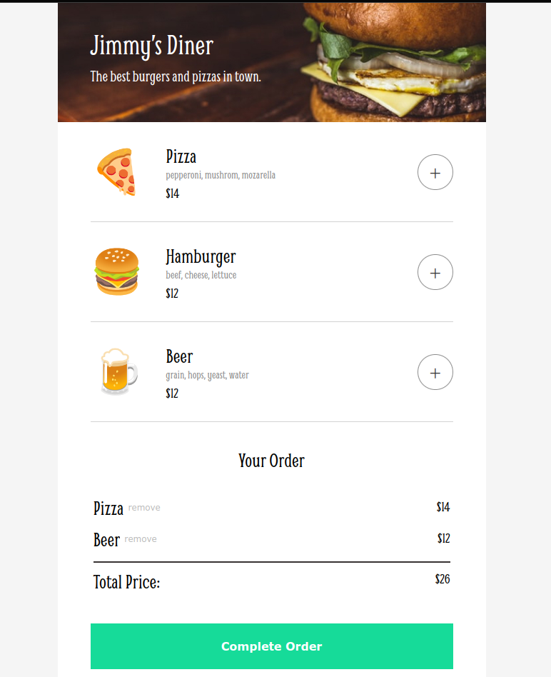

# Restaurant Ordering App

This project is developed using HTML, CSS, and JavaScript. It allows users to browse a menu, add items to a cart, remove items from the cart, and complete the order by submitting payment information.

## Getting Started

To get started with this project, clone this repository to your local machine.

```bash
git clone https://sergivanchenko.github.io/restaurant-ordering
```

## Screenshot



## Prerequisites
This project requires a web browser to run. You may use any modern web browser such as Google Chrome, Mozilla Firefox, or Microsoft Edge.

## Usage
To use this project, open the index.html file in your web browser. You will see a Restaurant Ordering App interface.

## Features
1. Renders the menu from an array of menu items.
2. Allows users to add items to the cart.
3. Updates the cart and the total price when items are added or removed.
4. Allows users to complete the order and submit payment information.

## Built With
This project was built using the following technologies: HTML, CSS, JavaScript.

## License
This project is licensed under the MIT License.